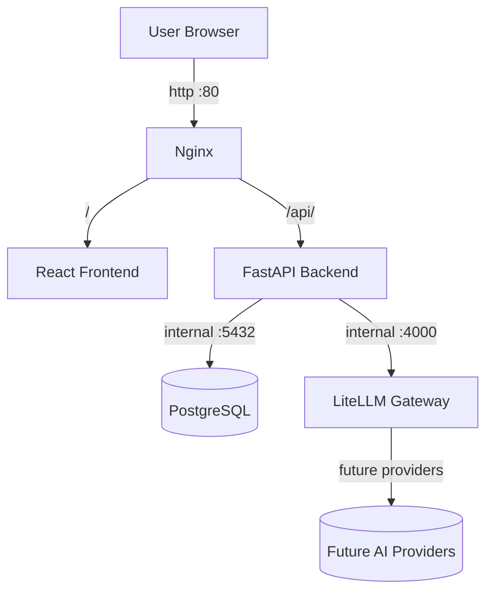
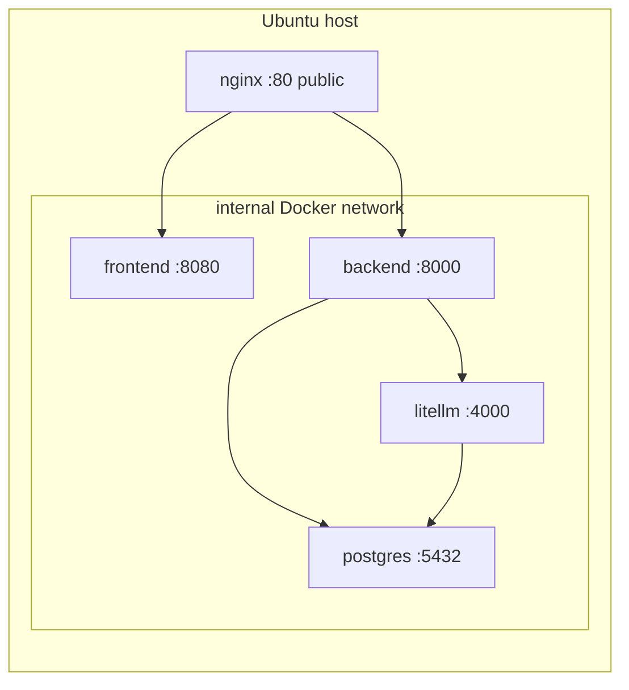
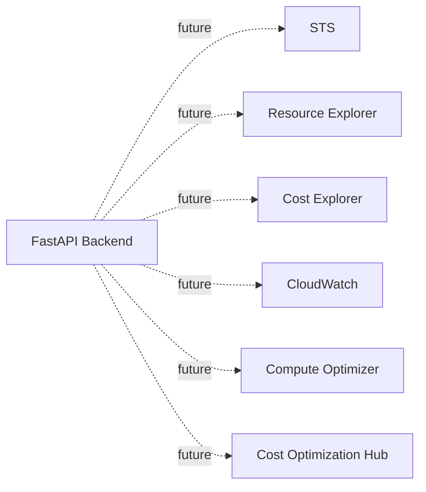

# Architecture — AI Cloud Cost Detective (AWS Edition, Phase 0)

This document is the source of truth for the platform architecture as of Phase 0.
Future AWS integrations are listed at the bottom and marked **NOT IMPLEMENTED IN PHASE 0**.

## High-level diagram (Phase 0 — current)



- **Browser → Nginx** is the only public edge. Nginx is the only service that
  binds a host port (80).
- **Nginx → Frontend** proxies `/` to the React static server on the internal
  network.
- **Nginx → Backend** proxies `/api/*` (rewriting to `/*`) to FastAPI on the
  internal network, with WebSocket upgrade headers ready for future use.
- **Backend → PostgreSQL** uses two logical databases inside one container:
  `cost_detective` (application data later) and `litellm` (LiteLLM metadata
  and spend tracking).
- **Backend → LiteLLM Gateway** is reachable only via the internal Docker
  network; the browser never sees the gateway or its master key.
- **LiteLLM → AI Providers** is a future integration (none configured in Phase 0).

## Container topology



## Service summary

| Service    | Image (pinned)                              | Host port   | Network       |
| ---------- | ------------------------------------------- | ----------- | ------------- |
| nginx      | `nginx:1.27.4-alpine`                       | `80:80`     | internal      |
| frontend   | `cost-detective-frontend:phase0` (custom)   | (none)      | internal :8080|
| backend    | `cost-detective-backend:phase0` (custom)    | (none)      | internal :8000|
| litellm    | `ghcr.io/berriai/litellm:v1.55.2`           | (none)      | internal :4000|
| postgres   | `postgres:16.6-alpine`                      | (none)      | internal :5432|

Image tags are recorded in `docs/phase0-report.md`.

## Backend endpoints (Phase 0)

| Method | Path             | Purpose                                                 |
| ------ | ---------------- | ------------------------------------------------------- |
| GET    | `/health`        | Liveness probe                                          |
| GET    | `/health/ready`  | Readiness probe; checks PostgreSQL + LiteLLM (sanitized)|
| GET    | `/`              | Service metadata                                        |
| GET    | `/docs`          | FastAPI auto-generated OpenAPI docs                     |

The frontend reaches the backend via `/api/*` (Nginx strips the prefix). The
browser bundle contains no `localhost:8000`, no `127.0.0.1:8000`, no EC2 public
IP, no `:4000`, and no `:5432`.

## PostgreSQL layout

One container, two logical databases, two roles:

```
postgres
├── cost_detective (db)   owner=cost_detective_user   — application data later
└── litellm       (db)    owner=litellm_user          — LiteLLM keys/spend/metadata
```

Both roles and databases are created idempotently on first start by
`postgres/init/create-databases.sh`. Passwords come from `.env` only.

## LiteLLM Gateway

- Runs in its own container.
- Connects to the `litellm` PostgreSQL database via `DATABASE_URL`.
- Carries zero configured provider models in Phase 0; readiness only.
- The browser never sees `LITELLM_MASTER_KEY` or any provider key.

## Health-check design

Each service has a Docker healthcheck. `depends_on` uses
`condition: service_healthy` to avoid race conditions on first boot:

- postgres: `pg_isready -U $POSTGRES_USER`
- litellm:   `wget http://localhost:4000/health/readiness`
- backend:   `wget http://localhost:8000/health`
- frontend:  `wget http://localhost:8080/`
- nginx:     `wget http://localhost:80/`

No arbitrary `sleep` waits are used as the primary dependency mechanism.

## Future AWS integration (NOT IMPLEMENTED IN PHASE 0)



All dashed nodes and edges are **NOT IMPLEMENTED IN PHASE 0**.
Authentication: read-only IAM role (preferably EC2 instance profile).
Deferred to later phase.
